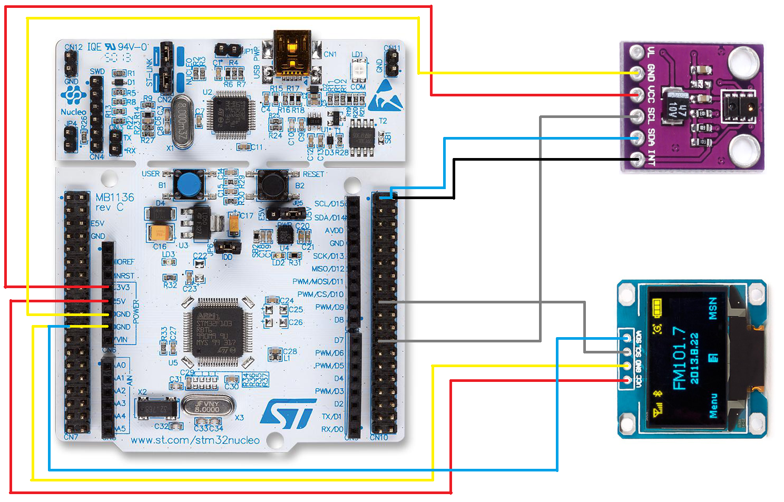
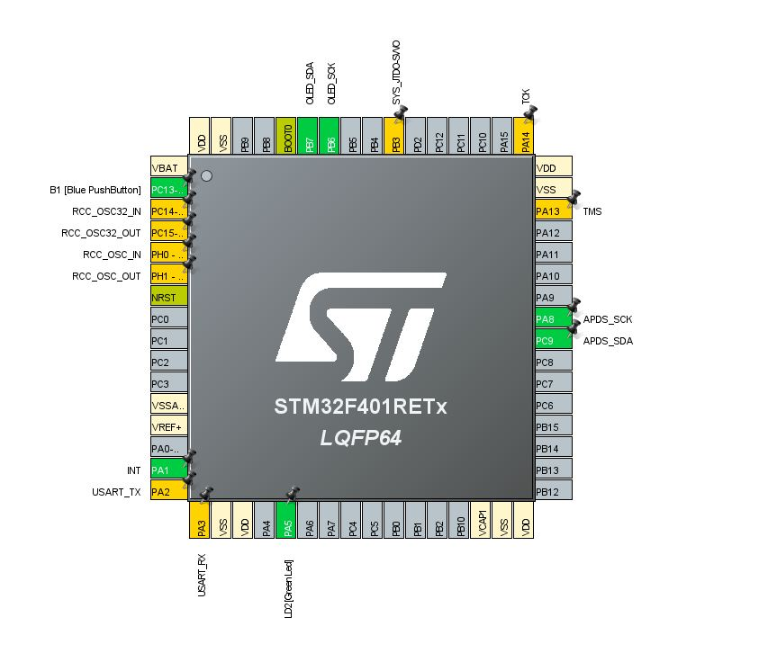
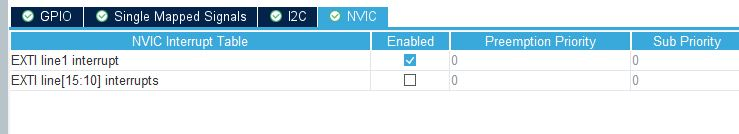
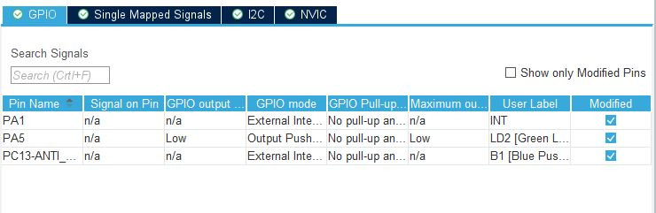
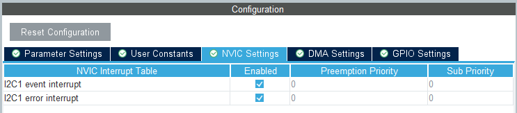
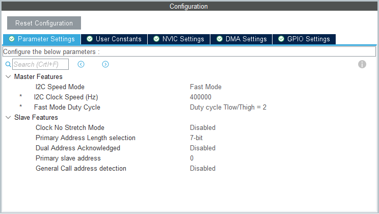

# APDS9930_API

## Introduction
This API was developed as a work in the discipline of Embedded Systems Programming at UFMG - Prof. Ricardo de Oliveira Duarte - Department of Electronic Engineering

Library is developed and tested with STM32F1xx (Nucleo 64 board). 

The main.c file contain exemples of usage based in Bare Metal programming. Therefore, the functions used in the exemple are executated by the hardware when the interruption caused by the peripherals is enabled for CPU service. When not executing the instructions of the function, CPU will be executing the infinite loop.

## Hardware requirements
* STM32F41xx microntroller;
* APDS-9930 ALS IR RGB and Gesture Sensor Proximity Sensor;
* 0.96 Inch Yellow and Blue I2C IIC Serial 128X64 OLED Display;

## Connections
The following image shows the connection diagram btween the hardware elements. 



## STM32CubeMX configuration
Pinout view:



GPIO Mode and Configuration:





I2C1 Mode and Configuration:



I2C1 and I2C2 Mode and Configuration/ Parameter Settings:



  
## API usage
1. Download APDS9930.c from the APDS9930_API/Core/Src and APDS9930.h from the APDS_API/Core/Inc 
directory;
2. Copy APDS9930.h to your projec's Inc directory and the APDS9930.c to your projec's Src directory;
3. Include where you expect to use.

## API functions
```C
bool APDS9930_Init();
```
 Define initialization values.
 
 
 ```C
 bool APDS9930_WriteRegData(uint8_t reg_adr, uint8_t data);
 ```
Write 8-bit data in one APDS9930 internal register.

Parameters:
  * ```reg_adr```: Internal memory address;
  * ```data```: Data buffer;
 
 
```C
bool APDS9930_WriteWordData(uint8_t reg_adr, uint16_t data);
```
Write 16-bit data in two APDS9930 internal register.

Parameters:
  * ```reg_adr```: Internal memory address;
  * ```data```: Data buffer;


```C
uint8_t APDS9930_ReadRegData(uint8_t reg_adr);
```
Return 8-bit data written in one APDS9930 internal register.

Parameters:
  * ```reg_adr```: Internal memory address;


```C
uint16_t APDS9930_ReadWordData(uint8_t reg_adr);
```
Return 16-bit data written in two APDS9930 internal register.

Parameters:
  * ```reg_adr```: Internal memory address;.


```C
bool set_PIT(uint16_t low, uint16_t high);
```
Set values of lower and upper thresholds of Proximity Sensor

Parameters:
  * ```low```: Proximity interruption low threshold value;
  * ```high```: Proximity interruption high threshold value;


```C
int which_INT();
```
Get interruption origin:
  *	0 - No interruption.
  *	1 - ALS interruption.
  *	2 - Proximity interruption.


```C
uint16_t Prox_data();
```
Get actual proximity measured data.


```C
void interrup_treat();
```
Begin interrupt treatment and define cause of interruption.


```C
void Prox_treat(uint16_t data);
```
Triggered by proximity sensor interrupt. Define which threshold was passed.
  *	Turn off the led if it was the high threshold.
  *	Do nothing if it was the low one.

Parameters:
  * ```data```: Proximity data in PDATA register;


```C
bool clear_INT();
```
Interrupt clear.


